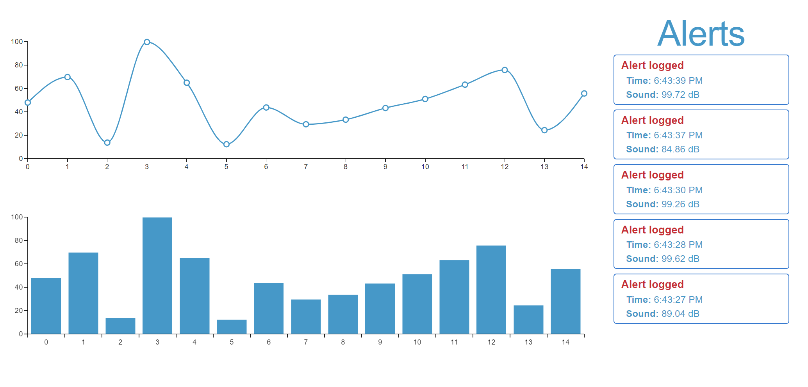
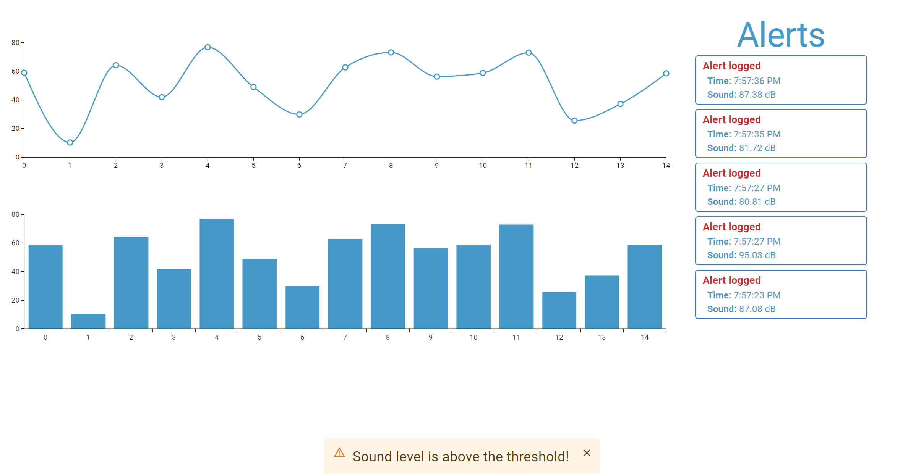
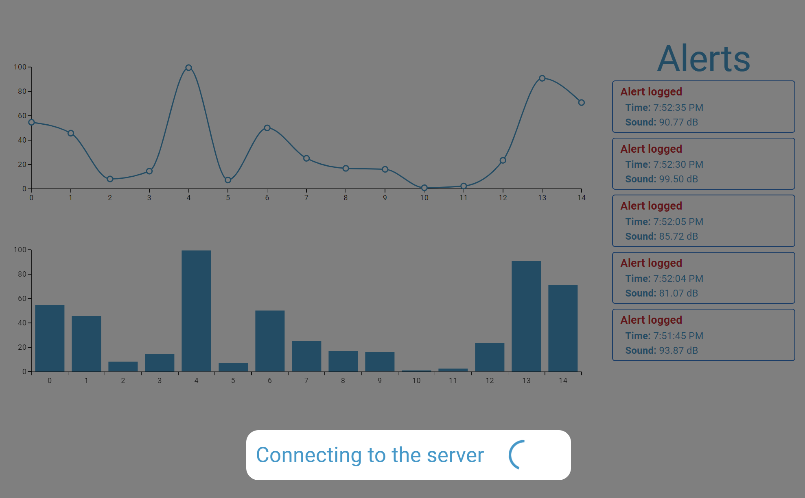

# iotevent

This project consists of a frontend and a backend. The frontend is built with Vite and the backend is built with Node.js. Both parts of the project use Socket.IO for real-time communication.


## Installation
To install the dependencies for both the frontend and the backend, run the `init.sh` script:

```bash
chmod +x init.sh
./init.sh
```

#### Running Backend only
```bash
npm run start
```

#### Running Frontend only
```bash 
npm run dev
```
## Usage
Frontend:
```http
http://localhost:8000
```
Backend:
```http
http://localhost:3000 
```





